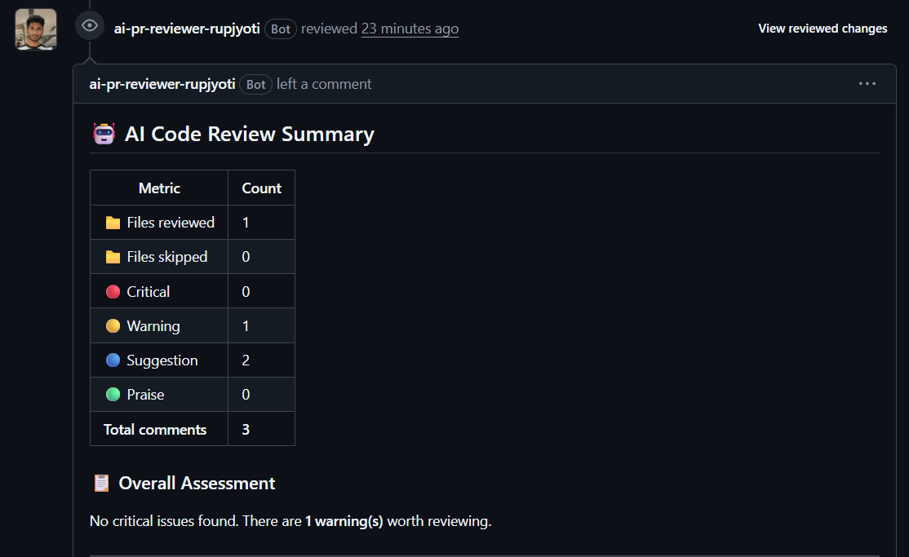
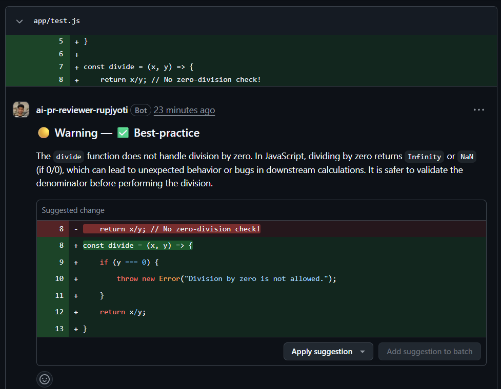
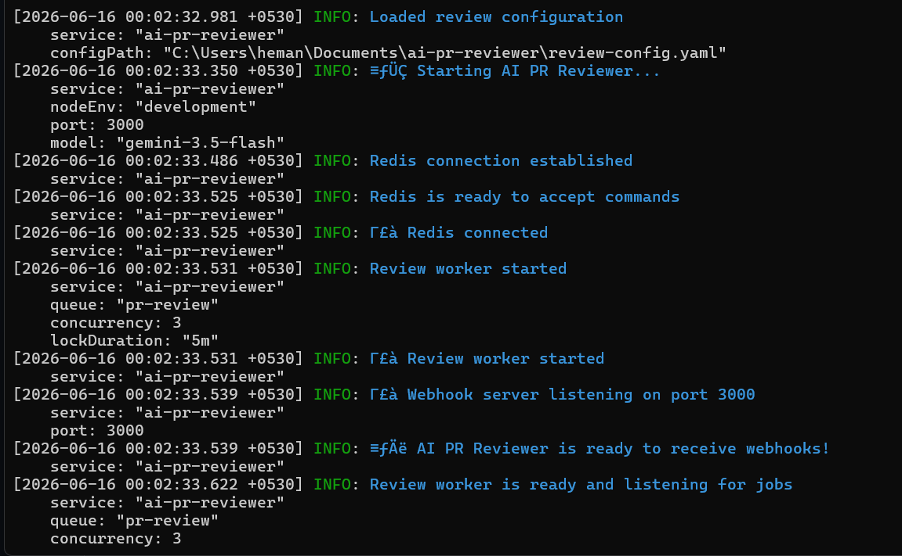

<div align="center">

# 🤖 AI PR Reviewer

### Automated AI-Powered Code Review for GitHub Pull Requests

[…
[](ht…
[](LICENSE)

**An intelligent GitHub App that automatically reviews pull requests using LLMs — catching bugs, security issues, and performance problems before they reach production.**

[Features](#-features) · [Demo](#-demo) · [Architecture](#-architecture) · [Quick Start](#-quick-start) · [Configuration](#-configuration) · [Deployment](#-deployment)

</div>

---

## 📸 Demo

### Bot Review Summary
> The bot posts a detailed summary table on every PR — showing files reviewed, issues found by severity, and an overall assessment.

<p align="center">
 
</p>

### Inline Code Comments
> AI-generated inline comments appear directly on the changed lines — just like a human reviewer would leave them.

<p align="center">
 
</p>

### Terminal — Successful Review Pipeline
> Real-time structured logs showing the complete review pipeline in action.

<p align="center">
 
</p>

---

## ✨ Features

<table>
<tr>
<td width="50%">

### 🔍 Smart Code Analysis
- **Bug Detection** — Off-by-one errors, null references, race conditions
- **Security Scanning** — Hardcoded secrets, injection risks, XSS vulnerabilities
- **Performance Review** — O(n²) algorithms, memory leaks, N+1 queries
- **Best Practices** — Error handling, typing, edge cases, SOLID principles

</td>
<td width="50%">

### ⚡ Production-Ready Architecture
- **Async Job Queue** — BullMQ + Redis for reliable processing
- **Token-Aware Chunking** — Splits large diffs intelligently
- **Rate Limiting** — Respects GitHub & AI provider API limits
- **Idempotent** — Duplicate webhooks don't trigger double reviews

</td>
</tr>
<tr>
<td width="50%">

### 💬 Rich GitHub Integration
- **Inline Comments** — Posted directly on changed lines
- **GitHub Suggestion Blocks** — One-click applicable code fixes
- **Severity Levels** — 🔴 Critical · 🟡 Warning · 🔵 Suggestion · 🟢 Praise
- **Review Summary** — Stats table with overall assessment

</td>
<td width="50%">

### 🔌 Multi-Provider AI Support
- **Google Gemini** — Free tier with excellent code understanding
- **Groq (Llama 3.3)** — Fastest free inference available
- **OpenAI GPT-4o** — Premium quality reviews
- **OpenRouter** — Access to 100+ models
- Easy to switch — just change 2 env variables

</td>
</tr>
</table>

---

## 🏗️ Architecture

```mermaid
flowchart TB
 subgraph GitHub["☁️ GitHub"]
 PR["🔀 Pull Request\n(opened / updated)"]
 API["📡 GitHub API"]
 end

 subgraph App["🖥️ AI PR Reviewer (Render.com)"]
 WH["🌐 Webhook Server\nExpress.js"]
 SIG["🔐 Signature Verification\nHMAC SHA-256"]
 Q["📋 Job Queue\nBullMQ"]
 W["⚙️ Worker"]
subgraph Pipeline["Review Pipeline"]
 FF["📁 File Filter\nIgnore patterns & size limits"]
 DP["📝 Diff Parser\nUnified diff → structured chunks"]
 CS["✂️ Chunk Strategy\nToken-aware splitting"]
 AI["🧠 AI Provider\nGemini / Groq / GPT-4o"]
 PS["✅ Response Parser\nZod schema validation"]
 end

 CM["💬 Comment Formatter\nMarkdown + suggestions"]
 end

 subgraph External["☁️ External Services"]
 Redis["🔴 Upstash Redis"]
 LLM["🤖 AI API\n(Gemini / Groq / OpenAI)"]
 end

 PR -->|"Webhook POST"| WH
 WH --> SIG
 SIG -->|"Valid ✅"| Q
 Q <--> Redis
 Q --> W
 W --> FF
FF --> DP
 DP --> CS
 CS --> AI
 AI <-->|"Code Review"| LLM
 AI --> PS
 PS --> CM
 CM -->|"Create Review"| API
 API -->|"Inline Comments"| PR

 style PR fill:#2da44e,color:#fff
 style AI fill:#4285F4,color:#fff
 style Redis fill:#dc382d,color:#fff
 style Q fill:#7c3aed,color:#fff
 style LLM fill:#0F9D58,color:#fff
